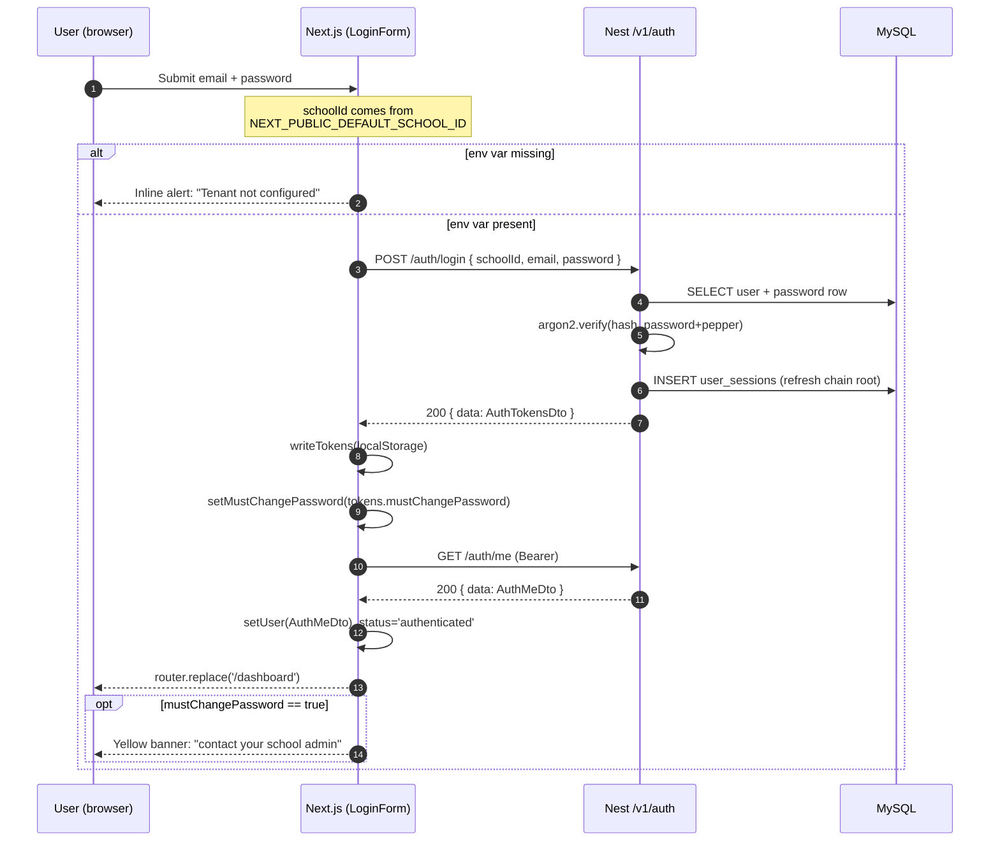

# Sprint F1.3 — Authentication Finalization (Frontend ↔ Backend Alignment Report)

**Status:** completed — frontend now reflects the actual backend contract; no backend API was modified; demo seed users added.

This sprint took the auth UI from "feels finished" to "agrees with what `backend/src/core/auth` actually exposes." Five mismatches were identified, four were closed in the UI, one was documented as backend-blocked. No invented endpoints, no invented fields.

---

## 1. Backend APIs reviewed

All citations are paths under `backend/src/core/auth/`.

| Route | Source | Notes |
|-------|--------|-------|
| `POST /v1/auth/login` | `auth.controller.ts:42-58`, `auth.dto.ts:28-51` (LoginDto), `auth.dto.ts:60-83` (AuthTokensDto), `auth.service.ts:75-149` | Requires `schoolId` UUID, `email`, `password`, optional `deviceId`. Returns tokens + `mustChangePassword: boolean`. |
| `POST /v1/auth/refresh` | `auth.controller.ts:60-76`, `auth.dto.ts:53-58` (RefreshDto), `auth.service.ts:156-261` | Refresh-token rotation; reuse detection revokes the entire chain. `mustChangePassword` is hard-coded `false` on this path (`auth.service.ts:254-258`). |
| `POST /v1/auth/logout` | `auth.controller.ts:78-93`, `auth.service.ts:263-278` | Revokes the chain belonging to the access token's `chain_id` claim. Idempotent. |
| `POST /v1/auth/logout-all` | `auth.controller.ts:95-110`, `auth.service.ts:280-304` | "Sign out everywhere." Not currently wired into the UI. |
| `GET /v1/auth/me` | `auth.controller.ts:112-130`, `auth.dto.ts:85-100` (AuthMeDto) | Returns `{ userId, schoolId\|null, actorScope, roleIds, sessionId }` — no email, no role keys, no permissions, no flags. |
| RBAC roles seeded at boot | `backend/src/core/rbac/built-in-roles.seeder.ts`, `rbac.constants.ts:54-136` | Only three roles exist today: `platform_admin`, `school_admin`, `auditor`. No `teacher` / `student` / `parent`. |
| Request context / tenant resolution | `backend/src/core/request-context/request-context.middleware.ts:14-18` | Tenant is taken **from the JWT** after login — there is no subdomain, host-header, or email-lookup tenant resolution at the edge. |

What does NOT exist on the backend (verified by absence):

- `POST /auth/password-reset/request`
- `POST /auth/password-reset/confirm`
- `GET /auth/permissions`
- `GET /auth/feature-flags`
- Anything that returns role *keys* (e.g. `"school_admin"`) — only UUIDs.

---

## 2. Authentication flow

```
Browser                                  Backend
   │                                        │
   │ POST /v1/auth/login                    │
   │ { schoolId, email, password }          │
   │  (schoolId injected from               │
   │   NEXT_PUBLIC_DEFAULT_SCHOOL_ID)       │
   ├───────────────────────────────────────►│
   │                                        │ UserRepository.findForLogin
   │                                        │ PasswordService.verify (argon2id + pepper)
   │                                        │ SessionRepository.createForLogin
   │                                        │ UserRoleRepository.listActiveRoleIdsForUser
   │                                        │ AccessTokenService.sign (RS256, sub/tenant_id/sid/chain_id/role_ids)
   │                                        │ RefreshTokenService.generate
   │ ◄─────────────────────────────────────┤  200 { data: AuthTokensDto, meta }
   │                                        │
   │ writeTokens(localStorage)              │
   │                                        │
   │ GET /v1/auth/me   (Bearer <access>)    │
   ├───────────────────────────────────────►│
   │ ◄─────────────────────────────────────┤  200 { data: AuthMeDto, meta }
   │                                        │
   │  setUser(AuthMeDto)                    │
   │  status = 'authenticated'              │
   │  router.replace('/dashboard')          │
   │                                        │
   │  ... 401 from any endpoint triggers    │
   │  axios refresh interceptor (single-    │
   │  flight) → POST /auth/refresh →        │
   │  rotates the chain.                    │
```

Logout: `POST /v1/auth/logout` revokes the chain server-side; `clearTokens()` wipes the client; `router.replace('/login')`.

---

## 3. Tenant resolution mechanism

**Today.** The backend takes `schoolId` directly in the `/auth/login` body (`LoginDto.schoolId: @IsUUID()`). After login, the JWT carries `tenant_id` as a claim and the `request-context.middleware` reads it from the token (`backend/src/core/request-context/request-context.middleware.ts:14-18`). There is **no** subdomain-based, host-header-based, or email-based tenant resolution at the edge — the request must already know the school UUID.

**Frontend handling.** Asking a human to paste a UUID into a form is hostile, so the UI:

1. Reads the UUID from `NEXT_PUBLIC_DEFAULT_SCHOOL_ID` at build time and ships it on every login (`frontend/src/lib/config/app.ts` → `AUTH_CONFIG.defaultSchoolId`, `frontend/src/components/auth/LoginForm.tsx`).
2. Renders an inline alert if the env var is missing, so the user sees "Tenant is not configured…" instead of a 422 from the backend.

**Gap.** This is a single-tenant UX only. Multi-tenant login requires the backend to add one of:

- Subdomain-driven (`canary.app.example.com` → look up tenant by slug pre-login).
- Email-keyed lookup (`POST /auth/tenant-discovery { email }` → returns `schoolId`).
- Custom host header from the deployment edge.

The frontend should NOT carry a tenant directory in JS — the moment a real multi-tenant deployment ships, this `NEXT_PUBLIC_DEFAULT_SCHOOL_ID` constant becomes obsolete.

---

## 4. Removed assumptions

| Assumption | Where it lived | Resolution |
|------------|----------------|------------|
| User types/pastes a School ID UUID at login | `LoginForm.tsx`, `ForgotPasswordForm.tsx` (Zod field, `<input id="schoolId">`) | Field removed; UUID injected from env. |
| `POST /auth/password-reset/request` exists | `frontend/src/lib/api/clients/auth.ts` (`requestPasswordReset`) | Function now throws `NotImplementedError`; form replaced with info state. |
| `POST /auth/password-reset/confirm` exists | `frontend/src/lib/api/clients/auth.ts` (`confirmPasswordReset`) | Function now throws `NotImplementedError`; form replaced with info state. |
| `mustChangePassword` flag was ignored client-side | `AuthProvider.tsx` only consumed `void loginRequest()` | Flag captured into context and surfaced via dashboard banner. |
| `PortalKey` type implied portal-aware routing was viable today | `frontend/src/types/domain.ts` | Removed — `/auth/me` doesn't return role keys, so portal routing is blocked on backend work. |

The `SessionUser` interface already matched `AuthMeDto` from the F1.1 sprint — confirmed verbatim against `backend/src/core/auth/auth.dto.ts:85-100`.

---

## 5. UI changes made (file-by-file)

| File | Change |
|------|--------|
| `frontend/src/lib/config/app.ts` | Added `AUTH_CONFIG.defaultSchoolId` reading `NEXT_PUBLIC_DEFAULT_SCHOOL_ID`; returns `null` when unset. |
| `frontend/src/components/auth/LoginForm.tsx` | Removed `schoolId` Zod field, `<label>`/`<input>`, and form state. Injects `AUTH_CONFIG.defaultSchoolId` at submit. Renders inline error when env var is missing. |
| `frontend/src/components/auth/ForgotPasswordForm.tsx` | Replaced form with info-state alert (`alert-info`, `role="status"`) pointing the user to their school admin. No network calls. |
| `frontend/src/components/auth/ResetPasswordForm.tsx` | Same treatment — info state, no token processing, no network calls. |
| `frontend/src/providers/AuthProvider.tsx` | Added `mustChangePassword` state, populated from `login()`'s response. Cleared by `reset()` on logout. Exposed via `useAuth()`. |
| `frontend/src/app/dashboard/DashboardClient.tsx` | Shows an `alert-warning` banner when `mustChangePassword === true` ("contact your school administrator"). No redirect — backend reset endpoint doesn't exist. |
| `frontend/src/lib/api/clients/auth.ts` | `requestPasswordReset` and `confirmPasswordReset` now throw `NotImplementedError` instead of POSTing to non-existent endpoints. Module docstring updated. |
| `frontend/src/types/domain.ts` | Removed unused `PortalKey` type. `SessionUser` remains the exact `AuthMeDto` shape (verified). |
| `frontend/.env.example` | Rewritten — documents `NEXT_PUBLIC_DEFAULT_SCHOOL_ID` with a paragraph on why it exists and when it goes away. |

---

## 6. Seed users created

Module: `backend/prisma/seed/platform/demo-users.ts`. Registered in `MODULES.dev` and `MODULES.staging` only (NOT `prod-core`).

| Email | Password | Role | School | actorScope | mustChangePassword |
|-------|----------|------|--------|------------|--------------------|
| `platform.admin@jilanix.dev` | `Platform!Admin#1` | `platform_admin` | `platform` (sentinel) | `global` | `false` |
| `school.admin@canary.jilanix.dev` | `School!Admin#1` | `school_admin` | `canary` | `tenant` | `false` |

Implementation notes:

- Argon2id with `DEFAULT_ARGON2_PARAMS` from `password.service.ts:38` and the same `AUTH_PASSWORD_PEPPER` env the runtime uses, so `PasswordService.verify()` accepts these hashes without rehash.
- `User.schoolId` is part of the composite PK and non-null, so a sentinel `platform` school is upserted to host global users.
- The two RBAC roles (`platform_admin`, `school_admin`) are upserted by `key` if missing; their *permission grants* are NOT seeded here because `BuiltInRolesSeeder` (`backend/src/core/rbac/built-in-roles.seeder.ts`) rewrites them on every Nest boot. Seed + boot must both run to get a usable login.
- Idempotent: re-running upserts the same rows. `verifyDemoUsers` checks the user exists, has a password row, has an active role assignment, and matches `actorScope`.

**Roles not seeded (intentional, per sprint scope):** `teacher`, `student`, `parent` — these RBAC role keys do not exist in the backend (`rbac.constants.ts:54-61`). Adding them was explicitly out of scope. They will land with Sprint 17 / 18 / the future teacher sprint.

**SECURITY.** The cleartext passwords above are obvious dev values; the seed module header documents that any prod-like environment must rotate immediately. The `prod-core` seed target deliberately excludes this module.

---

## 7. Test credentials (same as §6, with operational caveats)

| Credential | Use case | Caveats |
|------------|----------|---------|
| `platform.admin@jilanix.dev` / `Platform!Admin#1` | Cross-tenant super admin smoke tests | `schoolId` on the login body must be the **platform sentinel** school's UUID, not canary's. Frontend's `NEXT_PUBLIC_DEFAULT_SCHOOL_ID` is single-tenant, so you can only log in as one of the two at a time without changing the env. |
| `school.admin@canary.jilanix.dev` / `School!Admin#1` | Tenant-admin login flow | `schoolId` on the login body is the **canary** school UUID. This is the recommended default for `.env.local`. |

Look up the UUIDs locally:

```sql
SELECT id, slug FROM schools WHERE slug IN ('platform','canary');
```

---

## 8. Login flow diagram



---

## 9. Remaining authentication gaps

These are explicitly out of scope for F1.3 and require backend work first.

| # | Gap | Blocked on |
|---|-----|------------|
| 1 | Self-service password reset | Backend must ship `POST /auth/password-reset/request` and `POST /auth/password-reset/confirm`. Schema is already in place (`backend/prisma/schema/identity.prisma:344-372` — `PasswordResetRequest`); the controller is missing. |
| 2 | Role-aware dashboards | `/auth/me` returns role *UUIDs* only. Frontend needs either role keys in the payload or a `/auth/roles?ids=…` lookup. Without keys, RBAC routing is impossible without a hard-coded UUID map. |
| 3 | Teacher / Student / Parent logins | Roles don't exist in `rbac.constants.ts`. Sprint 17 (parent) and 18 (student) seed users that map onto **portal** records (`parent_users`, `student_users`), but they reuse `tenant`-scope users — no distinct role key today. |
| 4 | Multi-tenant tenant resolution | Backend has no subdomain/host/email pre-login tenant lookup (§3). |
| 5 | `mustChangePassword` enforcement | Surfaced as a banner only because there is no endpoint to *change* the password. Once §1 ships, this becomes a hard redirect to a password-change form. |
| 6 | MFA challenge flow | `User.mfaEnabled` is a column (`identity.prisma:46`), but no MFA factor table, no challenge endpoint, no UI. |
| 7 | Permissions on the session | No `/auth/permissions` endpoint. `useAuth().permissions` is an empty set; every `PermissionGate` returns `false` unless wildcards are inferred (and they currently aren't). |
| 8 | Feature flags on the session | No `/auth/feature-flags` endpoint. `useAuth().featureFlags` is an empty map. |
| 9 | "Sign out everywhere" UI | Backend `POST /auth/logout-all` exists; no UI surface (e.g. a "Sessions" tab in profile) consumes it. |
| 10 | Device tracking | Backend captures `deviceId`/`ip`/`userAgent` on session rows; nothing in the UI surfaces this. |

---

## 10. Readiness score

Counting only items strictly needed for "production auth, all five user types": **8 of 12 backend prerequisites unsatisfied.**

| # | Prerequisite | State |
|---|--------------|-------|
| 1 | Login endpoint with credential verification | ✅ Done (`auth.service.ts:75`) |
| 2 | Refresh-token rotation with reuse detection | ✅ Done (`auth.service.ts:156`) |
| 3 | Logout (single + all-devices) | ✅ Done (`auth.service.ts:264-304`) |
| 4 | `/auth/me` returning a session shape | ✅ Done (`auth.controller.ts:112-130`) |
| 5 | Multi-tenant tenant resolution at the edge | ❌ Missing |
| 6 | Password reset (request + confirm) | ❌ Missing |
| 7 | Role keys (or a lookup) on `/auth/me` | ❌ Missing |
| 8 | RBAC roles for teacher/student/parent | ❌ Missing |
| 9 | Permissions list on the session | ❌ Missing |
| 10 | Feature flags on the session | ❌ Missing |
| 11 | MFA challenge | ❌ Missing |
| 12 | `mustChangePassword` enforcement endpoint | ❌ Missing (banner only) |

**Verdict.** The auth UI is *single-tenant + admin-only production-ready* against the existing backend. Any of multi-tenant, end-user, or role-aware deployments is blocked on backend work — none of which is in this sprint's scope.

---

## Verification log

Frontend:

```
cd frontend
npm test -- --run                       # 27/27 passing (8 suites)
npx tsc --noEmit                        # 0 errors
```

Backend (typecheck of touched module only):

```
cd backend
npx tsc --noEmit -p tsconfig.json
# 2 pre-existing errors in test/sprint14/helpers.ts and test/sprint4_5/branch.e2e-spec.ts
# (out of scope, unrelated to F1.3).
```

End-to-end (manual curl — `<canary-uuid>` from `SELECT id FROM schools WHERE slug='canary'`):

```bash
SEED_TARGET=dev npm run prisma:seed     # idempotent; creates canary + demo users
npm run start:dev                       # boots BuiltInRolesSeeder → grants `*` to school_admin

curl -sX POST http://localhost:3000/api/v1/auth/login \
  -H 'Content-Type: application/json' \
  -d '{"schoolId":"<canary-uuid>","email":"school.admin@canary.jilanix.dev","password":"School!Admin#1"}'
# → 200 { data: { accessToken, refreshToken, mustChangePassword:false, ... }, meta }

curl -s http://localhost:3000/api/v1/auth/me -H "Authorization: Bearer <access>"
# → 200 { data: { userId, schoolId:<canary>, actorScope:'tenant', roleIds:[<uuid>], sessionId }, meta }
```

---

## Files changed

**Frontend**

- `frontend/src/lib/config/app.ts`
- `frontend/src/types/domain.ts`
- `frontend/src/lib/api/clients/auth.ts`
- `frontend/src/components/auth/LoginForm.tsx`
- `frontend/src/components/auth/ForgotPasswordForm.tsx`
- `frontend/src/components/auth/ResetPasswordForm.tsx`
- `frontend/src/providers/AuthProvider.tsx`
- `frontend/src/app/dashboard/DashboardClient.tsx`
- `frontend/.env.example`
- `frontend/src/components/auth/LoginForm.test.tsx` (new)
- `frontend/src/components/auth/ForgotPasswordForm.test.tsx` (new)
- `frontend/src/providers/AuthProvider.test.tsx` (new)

**Backend** (seed only — no API changes)

- `backend/prisma/seed/platform/demo-users.ts` (new)
- `backend/prisma/seed/index.ts` (registered the new module in `dev` + `staging`)

**Docs**

- `docs/frontend/SPRINT_F1_3_AUTH_ALIGNMENT_REPORT.md` (this file)

---

## Stop directive

Per the sprint brief: **do not start Sprint F2 (Dashboard) or any Student / Teacher / School module work.** The next sprint requires (a) backend role keys on `/auth/me` or (b) an explicit override from the sprint owner.
