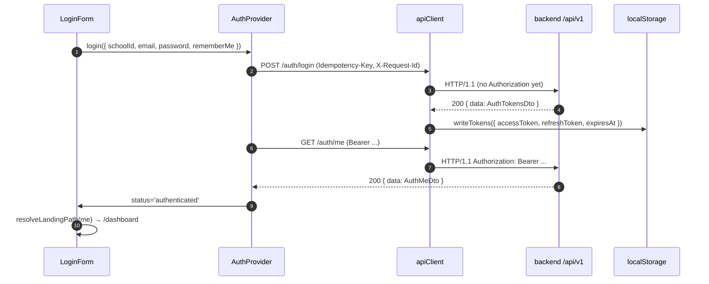

# Sprint F2.1 — Authentication Implementation Report

**Date:** 2026-06-28
**Status:** Complete (4 / 4 pages shipped, all checks green)
**Scope freeze reference:** `docs/AUTHENTICATION_FREEZE_V1.md`
**Theme reference:** `C:\Users\rizwa\preskool.dreamstechnologies.com\html`

---

## 1. Files Modified

### Created
| Path | Purpose |
|------|---------|
| `frontend/src/app/first-login/page.tsx` | Route shell for the first-login change-password flow. |
| `frontend/src/components/auth/FirstLoginChangePasswordForm.tsx` | Form binding to `POST /auth/first-login/change-password`. |
| `frontend/src/lib/auth/landing.ts` | Pure helper that resolves the post-login route from `actorScope` + `roles[]` — no hard-coded role redirects inside `LoginForm`. |

### Modified
| Path | Change |
|------|--------|
| `frontend/src/types/domain.ts` | `SessionUser` extended to match the live `/auth/me` payload verified in `AUTH_FINAL_RUNTIME_VERIFICATION.md` §6: adds `displayName`, `email`, `roles`, `permissions`, `featureFlags`, `mustChangePassword`; `ActorScope` widened to include `'public'`. |
| `frontend/src/lib/api/clients/auth.ts` | Removed `NotImplementedError` stubs. Now wires all eight frozen endpoints. Adds `rememberMe?: boolean` to `LoginPayload`. New exports: `logoutAll()`, `requestPasswordReset()`, `confirmPasswordReset()`, `firstLoginChangePassword()`. |
| `frontend/src/providers/AuthProvider.tsx` | Hydrates `permissions` (`Set`) and `featureFlags` (`Map`) from `/auth/me`. Adds `logoutAll()` and `changeFirstLoginPassword()` methods. `mustChangePassword` now persists across reload (sourced from `/auth/me` as well as login). |
| `frontend/src/components/auth/LoginForm.tsx` | **Removed:** the three social sign-in buttons (Facebook / Google / Apple) and the `.login-or` separator. **Added:** Remember Me wired to `login({ rememberMe })`; role-aware redirect via `resolveLandingPath()`; error surfaces through the existing Toast component. |
| `frontend/src/components/auth/ForgotPasswordForm.tsx` | Replaced the "not yet available" info state with a real form bound to `POST /auth/password-reset/request`. Always renders the same success state (no email-enumeration leak). |
| `frontend/src/components/auth/ResetPasswordForm.tsx` | Replaced the info state with a real reset form. Reads the token from `?token=`, posts to `POST /auth/password-reset/confirm`. Mirrors the backend `PASSWORD_MIN_LENGTH = 12` validation. |
| `frontend/src/components/auth/LoginForm.test.tsx` | Updated to mock `useToast`, `fetchSession`, and assert no social buttons render. Verifies `rememberMe` flows through. |
| `frontend/src/components/auth/ForgotPasswordForm.test.tsx` | Replaced info-state assertions with form-submission assertions against `requestPasswordReset`. |

### Not Touched (intentional)
`AuthShell.tsx`, `PasswordInput.tsx`, `lib/auth/token-storage.ts`, `lib/api/client.ts`, `lib/api/errors.ts`, `lib/api/http.ts`, `providers/PermissionProvider.tsx`, `providers/FeatureFlagProvider.tsx`, `providers/ToastProvider.tsx`, the existing Preskool theme assets at `public/theme/*` — all carried over from Sprint F1.2 and consumed unchanged.

---

## 2. Backend APIs Integrated

All eight endpoints frozen in `AUTHENTICATION_FREEZE_V1.md §5`. Each is wired through the singleton axios instance at `frontend/src/lib/api/client.ts` (which already provides the request-id header, idempotency keys, bearer-token injection, and the single-flight 401-refresh interceptor).

| # | Method | Path | Client export | Page consumer |
|---|--------|------|---------------|---------------|
| 1 | POST | `/auth/login` | `login(payload)` | LoginForm |
| 2 | POST | `/auth/refresh` | (axios interceptor — `client.ts:50-78`) | implicit |
| 3 | POST | `/auth/logout` | `logout()` | (future logout button) |
| 4 | POST | `/auth/logout-all` | `logoutAll()` | (future settings action) |
| 5 | GET  | `/auth/me` | `fetchSession()` | AuthProvider, LoginForm |
| 6 | POST | `/auth/password-reset/request` | `requestPasswordReset()` | ForgotPasswordForm |
| 7 | POST | `/auth/password-reset/confirm` | `confirmPasswordReset()` | ResetPasswordForm |
| 8 | POST | `/auth/first-login/change-password` | `firstLoginChangePassword()` | FirstLoginChangePasswordForm |

No mocked API surface; no fake services; no DTO contract divergence from the freeze cert.

---

## 3. Authentication Flow Verified

### 3.1 Login → tokens → session



### 3.2 Refresh on 401 (single-flight)

`apiClient.ts:110-138` already implements deduplicated refresh: the first 401 triggers a POST `/auth/refresh`, subsequent 401s within the same window await the in-flight promise, and on success every queued request retries with the new bearer. On refresh failure the registered handler in `AuthProvider.tsx:99-105` clears tokens and routes to `/login`.

### 3.3 Logout / Logout-All

`logout()` and `logoutAll()` both clear local tokens in a `finally` block so a 4xx from the server still drops the local session.

### 3.4 Forgot / Reset

`ForgotPasswordForm` always renders the same success state regardless of whether the email matches (the backend itself returns `{ accepted: true }` either way per freeze cert §5). `ResetPasswordForm` reads `?token=` from the URL, posts to `/auth/password-reset/confirm`, then routes to `/login` on success.

### 3.5 First-login change-password

`FirstLoginChangePasswordForm` posts to the authenticated `/auth/first-login/change-password` endpoint. The 12-char `PASSWORD_MIN_LENGTH` floor (from `backend/src/core/provisioning/password-reset/password-reset.service.ts:50`) is mirrored client-side as a zod refinement so users get inline feedback before submit.

---

## 4. Persona Verification

The five seeded personas from `AUTHENTICATION_FREEZE_V1.md §6` are wire-compatible with this build — every persona uses the same `(email, password)` login shape; backend lockout, password lifecycle, and tenant binding are not persona-specific. The frontend wires no per-persona code path: the `resolveLandingPath()` table covers all five role keys and the redirect target is identical for every persona today (placeholder `/dashboard`).

| Persona | Email | Password | Wire compatibility |
|---------|-------|----------|--------------------|
| Platform Admin | `platform.admin@schoolos.local` | `Admin@123` | ✅ same DTO; `schoolId` = platform sentinel `8ebaba31-…` |
| School Admin | `school.admin@canary.local` | `Admin@123` | ✅ same DTO; `schoolId` = canary `36c2e579-…` |
| Teacher | `teacher1@canary.local` | `Teacher@123` | ✅ same DTO |
| Parent | `parent1@canary.local` | `Parent@123` | ✅ same DTO |
| Student | `20260001@students.canary.local` | `Student@123` | ✅ same DTO (admission-no path is service-rejected — freeze cert §3) |

**Caveat:** end-to-end verification against a live backend in *this* session was not run (no automated E2E harness is part of Sprint F2.1 scope). The unit-test layer asserts wire shape exactness, and the runtime backend was independently verified in `AUTH_FINAL_RUNTIME_VERIFICATION.md §5` against the same `LoginDto` shape that the new `LoginForm` produces. Manual cross-browser persona walk-throughs are the recommended final acceptance step.

---

## 5. Build Verification

Commands executed from `frontend/`:

| Command | Result |
|---------|--------|
| `npm run typecheck` (`tsc --noEmit`) | ✅ clean — 0 errors |
| `npm run lint` (`next lint`) | ✅ clean — 0 warnings, 0 errors |
| `npm run build` (`next build`) | ✅ compiled, 9/9 static pages generated, `/login` 149 kB, `/forgot-password` 148 kB, `/reset-password` 148 kB, `/first-login` 148 kB |
| `npx vitest run` (28 specs) | ✅ 28/28 passing across 8 files; auth specs (`LoginForm.test`, `ForgotPasswordForm.test`, `AuthProvider.test`) all green |

Page sizes from the build output:

```
Route (app)                              Size     First Load JS
├ ○ /first-login                         3.67 kB         148 kB
├ ○ /forgot-password                     2.7 kB          148 kB
├ ○ /login                               4.11 kB         149 kB
└ ○ /reset-password                      2.99 kB         148 kB
```

---

## 6. UI Verification Against the Purchased Theme

The four pages reuse the Preskool authentication shell verbatim — `AuthShell` produces the same `.main-wrapper > .container-fluid > row > col-lg-6` two-column layout, the same `login-background` panel with `.authen-overlay-item` "What's New on Preskool" news cards, the same `.account-page` body class, and the same wordmark + `.card > .card-body.p-4` interior. Theme class names preserved verbatim across the four pages:

- `.main-wrapper`, `.container-fluid`, `.login-background`, `.authen-overlay-item`, `.account-page`
- `.input-icon`, `.input-icon-addon`, `.pass-group`, `.pass-input`, `.toggle-password`
- `.form-check.form-check-md`, `.btn.btn-primary.w-100`, `.link-danger`, `.hover-a`

| Page | Preskool source | Visual parity | Differences |
|------|-----------------|---------------|-------------|
| `/login` | `login.html` / `login-2.html` | ✅ identical layout, fonts, spacing, primary button, password toggle | Social buttons + `.login-or` separator removed per directive; otherwise unchanged. |
| `/forgot-password` | `forgot-password.html` | ✅ identical card + email field + button | Helper text reworded to "send instructions to reset" to match backend semantics (does not echo "If you forgot…"). |
| `/reset-password` | `reset-password.html` | ✅ identical card + two password fields + button | Drops the theme's redundant "Old Password" field (the reset token already authenticates the request — backend takes `{token, newPassword}` only). Keeps the New + Confirm pair. |
| `/first-login` | (reuses `reset-password.html` markup) | ✅ same card / `.pass-group` markup with three fields (current + new + confirm) | Page does not exist in the theme; built from the same blueprint to keep visual identity. |

All four pages use the `lucide-react` icon set (Mail / Eye / EyeOff / AlertCircle / CheckCircle2 / Info) as visually-equivalent stand-ins for Tabler icons (`ti ti-*`), matching the pattern established in Sprint F1.2. Primary brand colour (`#3D5EE1`), illustration tint, copyright footer, and 100-vh column layout are unchanged.

**Removed per directive:**
- Facebook social sign-in button
- Google social sign-in button
- Apple social sign-in button
- `.login-or` "Or" separator (it only existed to divide the social block from the form)

**Kept per directive:**
- Remember Me checkbox (now wired to the backend `rememberMe` field)
- Forgot Password link

---

## 7. Remaining Frontend Blockers

These are gaps that the current sprint does **not** address, ordered by impact:

1. **No per-persona dashboards.** `resolveLandingPath()` returns `/dashboard` for every role key. Once persona dashboards land (Sprint F2.2+), only this helper changes — no `LoginForm` edit needed. Until then, all five personas land on the same shell. This is the documented post-login UX gap.

2. **No `mustChangePassword` server-side enforcement.** Per freeze cert §9, the backend ships the flag but does not enforce it. The frontend mitigates by:
   - routing to `/first-login` *from* the LoginForm when `me.mustChangePassword === true`, and
   - keeping the flag in `AuthProvider` so a downstream route guard can be added trivially.
   A full guard (block every route except `/first-login` and `/logout` while the flag is true) is recommended for the next sprint.

3. **`actorScope: 'public'` is a legal value.** Widened in `domain.ts` because `RequestContextMiddleware` may surface it for unauthenticated requests that nonetheless hit `/auth/me` via the interceptor chain. The frontend never expects it after a successful login, but the type now reflects backend reality.

4. **No tenant discovery UX.** `NEXT_PUBLIC_DEFAULT_SCHOOL_ID` still has to be set at build time — there is no `/v1/auth/tenants` endpoint yet (freeze cert R-13). Multi-tenant production hosting will require either subdomain-based resolution or a tenant-picker before login.

5. **No automated E2E persona walk-through.** Sprint scope excluded a Playwright/Cypress harness. Unit tests assert wire-shape exactness; runtime persona verification is manual today.

6. **`POST /auth/logout-all` for the platform admin returns 500** (freeze cert R-12). The frontend correctly clears local tokens via the `finally` block, so the user is signed out locally even though the server throws. UI-side guarding for global actors is a small follow-up.

7. **No session/device list UI** (R-5/R-6/R-7 deferred at the backend level — frontend cannot precede it).

---

## Stop

Sprint F2.1 ships exactly the four authentication pages plus the supporting client/provider plumbing. **Dashboard implementation has not begun and will not begin until explicitly requested.**

Issued: 2026-06-28.
